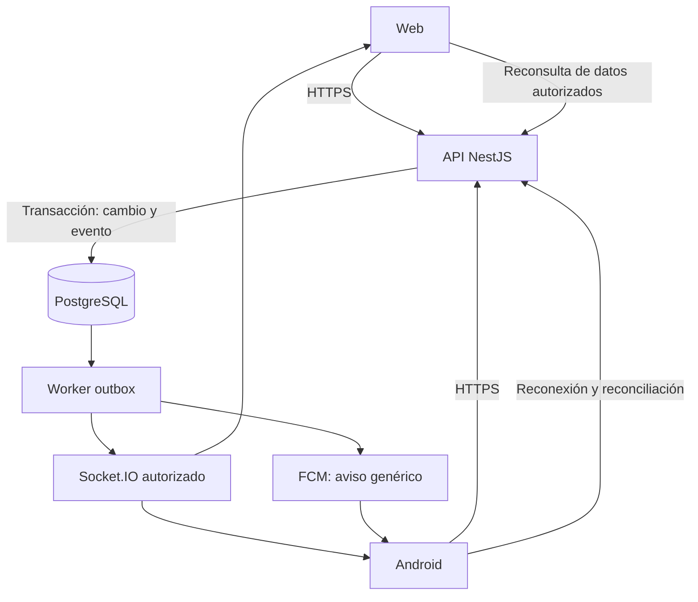

# Guía Médica Monagas — plan completo y estado de la app

Fecha de consolidación: 6 de octubre de 2026.

Este documento reúne las peticiones para la aplicación móvil, el plan técnico completo, el código implementado, los archivos generados, las comprobaciones y el trabajo pendiente. El alcance es la app móvil y su integración con la plataforma; no constituye una nueva auditoría del VPS ni de todos los cambios históricos del repositorio web.

## 1. Resultado actual

Existe una versión Android 0.1.0 instalable, conectada a la API productiva de Guía Médica Monagas. Se generaron un APK y un AAB de pruebas. El APK se instaló y abrió en un emulador Pixel 9 Pro.

**No se ha completado todo el plan de producción.** La compilación y el arranque están comprobados; los recorridos autenticados y las escrituras todavía necesitan cuentas de ensayo. No hay sincronización instantánea, push ni publicación en Google Play. El AAB actual usa firma de desarrollo.

La base de código se conserva compartida con iOS, pero no se compiló un IPA ni se probaron dispositivos Apple.

## 2. Peticiones y restricciones del usuario

1. Construir una app Android publicable en Google Play y conectada a la plataforma existente.
2. Usar las mismas cuentas, datos y reglas de autorización que la web.
3. Conseguir que los cambios se reflejen automáticamente en web y móvil; la meta final es tiempo real con recuperación ante desconexiones.
4. Crear el proyecto en una carpeta independiente: `E:\PROYECTO SEPTIEMBRE 2026\GUIA MEDICA APP`.
5. Conservar código, diseño y dimensiones compatibles con una futura versión iOS.
6. Preparar el proyecto para Android Studio y generar binarios Android.
7. Proteger los demás proyectos del servidor: no reutilizar sus configuraciones, puertos, redes ni recursos privados; no reiniciarlos ni modificarlos.
8. Documentar el plan, lo hecho, lo que falló y lo que falta.

La app es un cliente de la API existente: no necesita un nuevo servidor ni un puerto productivo adicional para instalarse. Un eventual entorno de staging y los servicios nuevos del proyecto deberán tener recursos propios. No se asignó una nueva IP pública y no debe confundirse independencia de proyectos con disponer automáticamente de otra IP.

## 3. Ubicaciones y configuración

| Elemento | Valor |
|---|---|
| Carpeta de la app | `E:\PROYECTO SEPTIEMBRE 2026\GUIA MEDICA APP` |
| Carpeta para abrir en Android Studio | `E:\PROYECTO SEPTIEMBRE 2026\GUIA MEDICA APP\android` |
| Plataforma web | `https://guiamedicamonagas.com` |
| API utilizada | `https://guiamedicamonagas.com/api/v1` |
| Repositorio de la plataforma | `https://github.com/merchandev/guiamedicamonagas` |
| Proyecto productivo identificado por el usuario | `gmm-independent` |
| VPS identificado por el usuario | `72.61.77.167` |
| Código de plataforma consultado | `E:\PROYECTOS AGOSTO 2026\GUIA_MEDICA_MONAGAS` |
| Paquete Android provisional | `com.guiamedicamonagas.app` |
| Identificador iOS provisional | `com.guiamedicamonagas.app` |
| Versión / versionCode / buildNumber | `0.1.0` / `1` / `1` |
| Android mínimo / targetSdk | API 24 / API 36 |
| Arquitecturas compiladas | `arm64-v8a`, `x86_64` |

No se incluyeron contraseñas, claves de servidor ni credenciales privadas en este documento. No se realizó commit, push, publicación ni despliegue productivo de la app durante esta entrega.

## 4. Arquitectura actual frente a la prevista

| Área | Implementación actual | Plan de producción |
|---|---|---|
| App | Expo, React Native y TypeScript | Mantener base multiplataforma |
| Navegación | Pestañas y estados React en App.tsx | Expo Router y rutas tipadas |
| Consultas | Cliente fetch propio y estado React | TanStack Query con invalidación y reconciliación |
| Formularios | Componentes y estado React; validación del servidor | React Hook Form/Zod donde resulte útil |
| Contratos | Tipos manuales en src/contracts.ts | OpenAPI y contratos compartidos con pruebas |
| Sesión | Access token en memoria; refresh actual por cookie | Transporte móvil explícito, rotación y revocación probadas |
| SecureStore | Soporte para un eventual refresh en cuerpo e indicador local de logout | Refresh móvil rotatorio cuando el backend admita ese transporte |
| Sincronización | REST cada 15 segundos en primer plano y reconsulta al volver a la app | Outbox PostgreSQL, worker, Socket.IO y recuperación |
| Push | No implementado | FCM Android; APNs para iOS |
| Enlaces | Esquema propio configurado; enlaces web | App Links y Universal Links verificados |
| Distribución | Builds locales APK/AAB con firma de desarrollo | Firma del titular, Play App Signing y distribución controlada |
| iOS | Configuración y código compartido; bundles generados en la etapa inicial | Compilación nativa, pruebas Apple y publicación propia |

La generación de la base Android avanzó antes de implementar el canal de eventos. Por ello, las fases de contratos/sesión y sincronización del plan siguen abiertas. Una app compilada no cierra esas fases.

Versiones declaradas en package.json al consolidar el documento: Expo `~57.0.27`, React Native `0.86.3`, React `19.2.3`, TypeScript `~6.0.3`, SecureStore `~57.0.4` y safe-area-context `~5.7.0`.

## 5. Funciones implementadas y alcance de su validación

“Implementado” significa que existe código conectado al contrato de la API. No significa que el flujo se haya probado con una cuenta real ni que esté aprobado para producción.

| Función | Estado del código | Evidencia / límite |
|---|---|---|
| Directorio público | Implementado | Pantalla abierta en emulador; API devolvió cero perfiles publicados |
| Búsqueda y paginación | Implementado | Consulta real; no había perfiles para probar resultados o detalles |
| Perfil público del médico | Implementado | Pendiente probar con profesional publicado |
| Disponibilidad y reserva | Implementado | Pendiente prueba de escritura y concurrencia en staging |
| Cancelación de cita | Implementado con confirmación | Pendiente recorrido autenticado |
| Agenda médica de 30 días | Implementado | Pendiente cuenta profesional de ensayo |
| Confirmar, completar y marcar inasistencia | Implementado | API conserva autorización y transiciones válidas; pendiente QA autenticada |
| Login y MFA por correo | Implementado | Pantalla visible; no se validó el recorrido con credenciales de ensayo |
| Registro de pacientes | Implementado | Formulario visible; no se creó una cuenta productiva |
| Consentimientos de registro | Casillas separadas, inicialmente desmarcadas | Términos, privacidad, salud y mayoría de edad |
| Recuperar contraseña | Implementado | Pendiente correo real en staging |
| Restablecer contraseña | Implementado con token copiado del enlace recibido | Falta apertura automática por App Link verificado |
| Cambiar contraseña | Implementado | Pendiente cuenta autenticada y revocación de otras sesiones |
| Avisos y marcado como leído | Implementado | Pendiente cuenta con avisos de ensayo |
| Editar teléfono y municipio | Implementado | Pendiente escritura de ensayo; no incluye toda la ficha clínica |
| Consultar/revocar permisos | Implementado | Filtra permisos vencidos/revocados; pendiente validar autorización entre cuentas |
| Solicitar eliminación | Implementado | Envía solicitud al equipo; no elimina inmediatamente la cuenta |
| Pedido de contacto por correo | Implementado con consentimiento | Sujeto a verificación de correo y plan del médico; pendiente QA |
| Retirar pedido de contacto | Implementado | Pendiente comprobar retirada y borrado visible entre cuentas |
| Cerrar sesión | Implementado con limpieza local e indicador en SecureStore | Persistencia de cookies y revocación remota pendientes de prueba |
| Diseño adaptable y teclado | Implementado | Revisión visual en emulador; falta matriz física completa |
| Botón Atrás de Android | Implementado | Regreso al directorio comprobado |
| Registro/administración de organizaciones | Web en el MVP propuesto | No hay módulo nativo de organizaciones |
| Administración | Web en el MVP propuesto | No hay panel administrativo nativo |
| Documentos, fotos y módulos clínicos avanzados | Pendiente | No están implementados en esta app |
| Récipes | Pendiente y condicionado | La consulta productiva registrada devolvió enabled=false |
| Consulta nativa de plan/suscripción | Pendiente | No hay compras nativas implementadas |
| Tiempo real y push | Pendiente | No existen en esta entrega |

## 6. Cambios técnicos realizados

### Base y compatibilidad

- Proyecto independiente con dependencias y lockfile propios.
- Entrada Expo en index.ts y aplicación React Native en App.tsx.
- SafeAreaProvider/SafeAreaView para barras, notch e indicador de inicio.
- Contenido flexible con máximo de 720 unidades y márgenes adaptativos.
- Orientación flexible, filas ajustables, texto escalable y botones de al menos 48 unidades.
- Formularios desplazables y KeyboardAvoidingView con comportamiento por plataforma.
- Configuración iOS con soporte de tablet y perfiles EAS para simulador, dispositivo y producción.

### Cliente API y sesiones

- API HTTPS común a la web; sin base de datos duplicada.
- Access token en memoria, timeout de 20 segundos y errores de conexión en español.
- Renovación compartida para evitar varias solicitudes simultáneas de refresh.
- Renovación en rutas autenticadas de cuenta, sin reintentar endpoints de credenciales indiscriminadamente.
- Contador de sesión para evitar que una renovación tardía restaure una sesión después de cerrar o cambiar de cuenta.
- Indicador local de logout en SecureStore para impedir restauración automática por cookie tras un cierre local sin conexión.
- Datos sensibles de pantallas en memoria; sin almacenamiento local de historias clínicas.

El backend consultado renueva mediante una cookie HttpOnly y no devuelve refreshToken en el cuerpo. El soporte cliente para guardar un eventual token en SecureStore no habilita ese transporte en el servidor. Se requiere validar cookies en dispositivos y diseñar el contrato móvil dedicado.

### Android nativo

- Generación de android/ con actividad, Gradle y wrapper.
- Scripts de prebuild, APK y AAB.
- Detección de Java 17, SDK y Gradle local sin modificar variables globales de Windows.
- Plugin reproducible de icono vectorial, HTTPS en release y backup desactivado.
- Bloqueo de permisos de almacenamiento y superposición no usados por la app.
- Versiones release de pruebas con JavaScript integrado, sin dependencia de Metro para ejecutarse.
- Separación visual entre login, registro y recuperación después de observar el formulario duplicado.

## 7. Inventario principal de archivos

| Archivo/carpeta | Responsabilidad |
|---|---|
| App.tsx | Pantallas, directorio, citas, avisos, cuenta y navegación |
| index.ts | Entrada Expo |
| src/api.ts | HTTP, sesión, refresh, errores y logout |
| src/contracts.ts | Tipos API, estados, errores y fechas de Caracas |
| src/AccountForms.tsx | Registro y recuperación/restablecimiento |
| src/SecuritySettings.tsx | Cambio de contraseña |
| src/PatientAccount.tsx | Contacto, permisos y eliminación de cuenta |
| src/DoctorAppointmentActions.tsx | Transiciones de citas del profesional |
| src/ContactDoctor.tsx | Pedido de contacto con consentimiento |
| src/ContactRequests.tsx | Lista y retirada de pedidos |
| plugins/withAndroidBranding.js | Configuración nativa reproducible de icono/HTTPS/backup |
| scripts/build-android.ps1 | Compilación y copia de APK/AAB |
| android/ | Proyecto nativo para Android Studio |
| app.json / eas.json | Configuración de plataformas y perfiles de build |
| package.json / package-lock.json | Scripts y versiones instaladas |
| .env.example | Configuración pública de API, sin secretos |
| test/contracts.test.ts | Fechas de Caracas y mensajes de validación |
| README.md | Funciones y límites de la app |
| MULTIPLATAFORMA.md | Diseño Android/iOS y matriz pendiente |
| ANDROID.md | Apertura en Android Studio y builds |
| ENTREGA-ANDROID.md | Evidencia de entrega y fallos resueltos |

node_modules/, dist/, dist-android/, .tools/, artifacts/, claves, .env y archivos locales de Gradle/IDE se excluyen de Git según corresponda. No se creó un repositorio remoto independiente para la app ni se publicó su código en el repositorio de la web.

## 8. Binarios y comprobaciones

| Entregable | Ruta relativa a la app | Tamaño |
|---|---|---|
| APK instalable de pruebas | artifacts/guia-medica-monagas-pruebas.apk | 42.226.174 bytes |
| AAB de pruebas | artifacts/guia-medica-monagas-pruebas.aab | 28.880.733 bytes |
| Captura del directorio | artifacts/android-home.png | Evidencia visual |
| Captura de cuenta | artifacts/android-account.png | Evidencia visual |
| Captura de registro final | artifacts/android-register.png | Evidencia visual |

SHA-256 del APK entregado: `946348FD6DB6BD79AC867477663440D433CF2F8F345BB115B68F4E31C8BCD061`.

Comprobaciones registradas:

1. TypeScript sin errores.
2. Dos pruebas de contratos aprobadas.
3. Dependencias alineadas con Expo según expo install --check.
4. Exportación Android y, en la etapa inicial, bundles Android/iOS/web generados.
5. Builds Gradle finales de APK y AAB exitosos.
6. Firma APK válida mediante apksigner.
7. Paquete, SDK y arquitecturas inspeccionados.
8. Instalación y arranque en emulador Pixel 9 Pro.
9. Directorio, cuenta y registro visibles; Atrás vuelve al directorio.
10. Reinstalación final con registro visible y cero formularios de login duplicados en esa pantalla.
11. No se observaron errores fatales de la app en los registros consultados.
12. Consultas públicas registradas: health, directorio y configuración de récipes respondieron HTTP 200; directorio vacío y récipes apagados.

No se probaron escrituras con pacientes reales. No se crearon cuentas ni citas productivas. La validación de un formulario visible no demuestra que todo su recorrido de servidor y correo funcione.

## 9. Problemas encontrados y resultado

| Problema | Acción / resultado |
|---|---|
| No existía android/ | Se generó el proyecto nativo con Expo prebuild |
| Java y adb no estaban en PATH | Se localizaron herramientas instaladas y Java 17 provisionado por Gradle |
| Descarga Gradle interrumpida | Distribución oficial recuperada por fragmentos y SHA-256 comprobado |
| Tarea de CMake fallida en el primer intento | Repetición aislada con Java 17 y dependencias preparadas: pasó; no se atribuye una causa única sin evidencia |
| Descarga Hermes con Connection reset | Archivo completado desde Maven Central y SHA-1 oficial comprobado; build posterior pasó |
| Emulador cerrado | Se inició el AVD existente sin ventana, se probó la app y se cerró ese proceso de pruebas |
| Login junto al registro | Se separaron los flujos y se regeneraron/reinstalaron los binarios |
| 22 alertas npm audit | Pendientes: 7 moderadas y 15 altas transitivas; no se aplicó una degradación incompatible a Expo 44 con --force |
| Advertencias nativas y Gradle | No impidieron los builds finales; deben revisarse al actualizar dependencias |

Las descargas verificadas y las herramientas de compilación son locales. No se tocaron los servicios productivos para resolver estos problemas.

## 10. Abrir, ejecutar y recompilar

En Android Studio, abrir `E:\PROYECTO SEPTIEMBRE 2026\GUIA MEDICA APP\android` y seleccionar Java 17 como Gradle JDK.

Rutas disponibles en este equipo:

```text
JDK 17: C:\Users\merch\.gradle\jdks\eclipse_adoptium-17-amd64-windows.2
SDK:    C:\Users\merch\AppData\Local\Android\Sdk
```

Desde PowerShell:

```powershell
cd "E:\PROYECTO SEPTIEMBRE 2026\GUIA MEDICA APP"
npm ci
npm run typecheck
npm test
npm run android
```

npm run android compila debug y usa Metro. Para generar versiones de pruebas independientes de Metro:

```powershell
npm run android:apk
npm run android:aab
```

Regeneración nativa:

```powershell
npm run android:prebuild
```

Revisar cambios nativos propios antes de regenerar. En otro equipo, configurar rutas de JDK/SDK propias; no copiar android/local.properties como una ruta universal. Los binarios actuales son de pruebas, no paquetes de publicación con la firma definitiva.

## 11. Prioridades restantes y criterios de cierre

| Orden | Trabajo | Evidencia necesaria para cerrarlo |
|---|---|---|
| 1 | Staging aislado y cuentas ficticias | API, datos, correo y almacenamiento de ensayo sin afectar producción |
| 2 | Sesión móvil | Login/MFA, cookies o transporte dedicado, rotación, reinicio, logout y cambio de usuario probados |
| 3 | Contratos y navegación | Cliente tipado, rutas y pruebas de compatibilidad web/móvil |
| 4 | Tiempo real | Cita cambiada desde web visible en móvil y viceversa, con reconexión y autorización |
| 5 | QA de funciones existentes | Registro, correo, reserva, cancelación, agenda, permisos, contacto y eliminación completos en staging |
| 6 | Completar MVP | Perfil profesional, mensajes, código de paciente, documentos y estado del plan según alcance acordado |
| 7 | Push y enlaces | FCM en teléfono físico, desvinculación al salir y App Links verificados |
| 8 | Seguridad/calidad | Alertas de dependencias evaluadas, privacidad, accesibilidad, concurrencia y recuperación probadas |
| 9 | Google Play | Titular, firma, AAB de publicación, ficha, declaraciones y beta aceptadas |
| 10 | iOS | Build nativo, dispositivos Apple, APNs, Universal Links y publicación independiente |

No se asigna un porcentaje global de avance: no hay una estimación ponderada suficiente para sostenerlo. Los plazos del plan son estimaciones iniciales, no una fecha de entrega recalculada ni garantizada.

## 12. Plan técnico completo de producción

Las secciones siguientes conservan el contenido del plan consolidado, con las frases de estado actualizadas para evitar afirmar que no existe la app. Son la arquitectura y el alcance objetivo. La matriz anterior indica qué se implementó realmente. Las referencias a requisitos de tiendas y costes proceden del plan fechado el 6 de octubre de 2026 y deben verificarse nuevamente antes de publicar o contratar.

### 1. Decisión recomendada

Construir una app Android con React Native, Expo y TypeScript; conservar Next.js para la web y NestJS, Prisma y PostgreSQL como plataforma común. Primero se implementa y prueba la sincronización en la web; después se conectan las pantallas móviles.

Una app con experiencias de paciente y médico por rol. Administración y organizaciones permanecen en la web inicialmente. iOS se incorpora después con reutilización de lógica, pero con pruebas y publicación propias.

Las cuentas, permisos, consentimientos, documentos, citas y suscripciones viven en el backend existente. Firebase se utiliza únicamente para push, sin añadir Firestore ni otra base clínica.

### 2. Comparación y mejoras

| Punto | Decisión consolidada |
|---|---|
| Expo y TypeScript | Mantener. Compartir contratos y lógica pura; diseñar pantallas nativas. |
| Tiempo real primero | Mantener. Una demostración web/móvil debe validar la arquitectura antes de ampliar funciones. |
| Ningún aviso se pierde | Sustituir la promesa por persistencia transaccional, entrega al menos una vez, deduplicación, reintentos y reconciliación. Push no garantiza recepción inmediata. |
| ID creciente como cursor | No asumir orden de confirmación por un BIGSERIAL: transacciones pueden confirmar fuera de orden. Diseñar un log de entrega ordenado por destinatario o usar reconsulta completa inicialmente. |
| Redis como respaldo | Redis distribuye eventos entre instancias; PostgreSQL conserva la evidencia durable. Un adaptador Pub/Sub no equivale a recuperación persistente. |
| Funciones se encienden simultáneamente | Solo si la versión móvil ya contiene la función y soporta su contrato. Combinar flags, capacidades y versión instalada. |
| API nunca cambia | Mantener contratos compatibles dentro de v1; cambios incompatibles requieren nueva versión y periodo de coexistencia. |
| Sin cambios de proxy | Verificar upgrade, rutas y tiempos de espera. Puede requerirse ajustar únicamente la configuración propia del proyecto. |
| Datos nunca salen del servidor | El dispositivo los recibe y un PDF exportado puede quedar en Descargas, correo o WhatsApp. Documentar la frontera y obtener confirmación de exportación. |
| WebView siempre rechazado | No es una prohibición universal. Expo se elige por experiencia y capacidades; cualquier enfoque debe cumplir calidad, permisos y políticas. |
| Flutter no reutiliza nada | Puede reutilizar backend y contratos; comparte menos código de interfaz y lógica TypeScript. |
| EAS Update evita revisión | Solo actualizaciones compatibles con el runtime nativo y las políticas. Nuevos módulos y permisos requieren un nuevo binario. |
| Sin coste adicional de servidor | Medir conexiones, memoria, transferencia, almacenamiento y worker antes de afirmarlo. |
| Cuenta personal para la app médica | Planificar cuenta de organización verificada y D-U-N-S para este producto. |

### 3. Objetivos y límites

#### Objetivos

- Misma información autorizada en web y móvil.
- Cambio visible automáticamente en sesiones abiertas.
- Recuperación tras desconexión y reinicios.
- Revocación de acceso coherente entre dispositivos.
- Publicación en Google Play con privacidad y soporte operativos.

#### Límites

- Sin conexión no existe sincronización inmediata.
- Android puede suspender la app; push avisa y al volver a primer plano se reconcilian los datos.
- No se incluyen historias clínicas editables sin conexión en el primer lanzamiento.
- Una función apagada por revisión legal permanece apagada en ambos clientes.
- Los eventos públicos no revelan pacientes, reservas individuales ni datos clínicos.

Meta inicial: p95 menor de 2 segundos desde la confirmación del servidor hasta la actualización visible, bajo una carga y red definidas. Medir también p99, retraso del outbox, errores y recuperación. No garantizar simultaneidad absoluta.

### 4. Stack

| Área | Selección |
|---|---|
| App | React Native + Expo, SDK estable compatible elegido al iniciar |
| Navegación | Expo Router |
| Consultas y caché | TanStack Query |
| Estado local | React; Zustand solo donde exista necesidad concreta |
| Formularios | React Hook Form + Zod |
| Tiempo real | Socket.IO cliente y gateway NestJS |
| Sesiones | Access token en memoria; refresh token rotatorio en SecureStore |
| Push | expo-notifications + FCM directo desde backend para Android |
| Cámara y archivos | Módulos Expo para cámara, selectores, filesystem y compartir |
| UI | Componentes y tokens propios; evaluar NativeWind, calendario y listas en una prueba de compatibilidad |
| Persistencia de eventos | PostgreSQL outbox y worker del proyecto |
| Varias instancias | Redis Streams adapter si hace falta; validar reconexión y despliegue |
| Errores | Sentry como propuesta inicial, con filtrado y revisión de privacidad; Crashlytics es alternativa |
| Distribución | EAS Build/Submit, Play App Signing y AAB |
| Calidad | Tests API, React Native Testing Library, Maestro y pruebas manuales Android/TalkBack |

Usar development builds desde el inicio. No fijar combinaciones de Expo/React Native copiadas de un plan sin verificar su soporte actual.

### 5. Repositorio y contratos

Estructura propuesta:

```text
backend/                  API, worker, eventos y migraciones
frontend/                 Web existente
mobile/                   App Expo
packages/contracts/       DTO públicos, eventos y cliente generado
packages/domain/          Validaciones y funciones puras compatibles
packages/legal/           Textos y versiones legales
docs/                     Decisiones, operación y publicación
```

Elegir un solo esquema de workspaces y lockfiles tras probar Docker y CI. No reorganizar todo el repositorio como condición para comenzar. Los paquetes compartidos no importarán Prisma, secretos, APIs de navegador ni dependencias exclusivas del backend.

OpenAPI genera clientes tipados; los tests verifican contratos y errores. La autoridad de validación y permisos permanece en el servidor. Compartir Zod no convierte los datos recibidos del móvil en confiables.

Si Docker necesita paquetes externos a frontend/, ajustar su contexto y .dockerignore para excluir .env, credenciales y archivos locales. Registrar la revisión de builds antes de producción.

### 6. Diseño de sincronización



#### Escritura

1. Validar sesión, permisos, consentimiento y versión del recurso.
2. Aplicar cambio y registrar evento en una sola transacción.
3. Responder con estado confirmado y nueva versión.
4. Worker procesa eventos con bloqueo de filas, reintentos y estado de error.
5. Cliente invalida las consultas afectadas y obtiene la representación autorizada.

Registrar eventos desde todos los caminos: web, móvil, administración, cron, vencimientos, revisión de pagos y BCV. No publicarlos antes de confirmar la transacción.

#### Entrega y recuperación

- Cada evento tiene eventId, tipo, recurso, versión y destinatarios determinados por el servidor.
- El worker puede entregar más de una vez; el consumidor es idempotente.
- dispatcheado no significa recibido por todos los dispositivos.
- Un cursor global de IDs de inserción puede saltarse una transacción tardía. Para replay durable, asignar secuencias de entrega por destinatario después de confirmar el evento y serializar su publicación.
- Primera versión admite invalidación completa al reconectar como mecanismo seguro, mientras se construye replay incremental.
- Snapshot y cursor deben ser coherentes: conectar y almacenar temporalmente eventos durante la lectura inicial, o establecer un protocolo equivalente y probar la carrera.
- Cursores fuera de retención provocan RESET_REQUIRED y consulta completa; no devuelven silenciosamente una lista vacía.
- Replay aplica permisos actuales; no entrega datos por una autorización histórica revocada.
- Mantener comprobación periódica de respaldo y reconsulta al recuperar foco. WebSocket no es la única protección contra desactualización.

#### Conflictos

- Reserva y pago: idempotency key y restricciones existentes de base de datos.
- Perfil, horario y talonario: version o ETag; ante conflicto devolver 409/412 y permitir revisar antes de reenviar.
- Cambios sensibles requieren confirmación del backend; no presentar emisión o reserva como completada de forma optimista.
- Eventos de disponibilidad pública invalidan horarios agregados con coalescencia y límites, sin exponer IDs de pacientes.

#### Seguridad del canal

El servidor asigna salas; el cliente no puede elegir una sala arbitraria. Revalidar expiración, tokenVersion y permisos al conectar, reconectar y renovar. Revocaciones expulsan sesiones y eliminan caché sensible. La recuperación de conexión no debe saltarse autorización.

No utilizar IDs o tokens clínicos en URLs de socket, logs o métricas. El canal y el replay admiten límites de conexión y de tamaño. El acceso administrativo a identidades debe seguir condicionado por la bóveda, incluso si una sala administrativa está abierta.

### 7. Sesiones, push y enlaces

#### Sesiones

- Revisar JWT actual antes de declarar que sirve sin cambios: expiración, audience, sesiones y revocación deben ser compatibles.
- Endpoint móvil o negociación explícita de transporte para renovar tokens; la web conserva cookies protegidas y su defensa CSRF.
- Refresh token en cuerpo solo en rutas diseñadas para ese transporte, sin logging de credenciales.
- Rotación, detección de reutilización, dispositivos y cierre remoto; cuenta y dispositivo no se identifican por un encabezado manipulable como única defensa.
- Límites por cuenta, IP y señales de abuso. Un identificador de instalación es auxiliar, no prueba de identidad.
- Mantener el MFA actual; biometría local no sustituye autenticación del servidor.

#### Push

- Registrar token FCM por instalación y sesión; actualizarlo cuando cambie y desvincularlo al salir o cambiar de usuario.
- Payload genérico: tipo e identificador opaco, sin nombres de pacientes, síntomas ni contenido del récipe.
- Preferencias por usuario y canales Android; registrar entrega al proveedor sin afirmar que el usuario leyó.
- Credencial de servicio únicamente en backend, con mínimo privilegio y rotación. La configuración pública Android no es esa credencial.
- Reintentar errores temporales, limpiar tokens inválidos y evitar avisos a usuarios con permisos revocados.

#### App Links

Publicar assetlinks.json usando el certificado de firma de Play, y comprobar rutas en teléfonos instalados desde la tienda. Verificación, recuperación y QR deben tener fallback web. Probar particularmente fragmentos de códigos; nunca consumir automáticamente tokens por abrir el enlace.

### 8. Alcance por versiones

| Función | MVP Android | Ampliación |
|---|---|---|
| Directorio, búsqueda y perfiles | Sí | Optimización y favoritos si se solicitan |
| Login, verificación, recuperación y seguridad | Sí | Métodos adicionales según decisión |
| Citas y disponibilidad | Sí | Funciones avanzadas de agenda |
| Pedidos de contacto y avisos | Sí | Nuevos canales según consentimiento |
| Paciente: código y permisos | Sí | Flujos avanzados de consentimiento |
| Médico: agenda, citas, mensajes y perfil | Sí | Estadísticas y publicaciones |
| Documentos con cámara/selectores | Sí, tras QA de legibilidad | Optimización adicional |
| Consulta del plan vigente | Sí | Compras únicamente con diseño de pagos aprobado |
| Récipes: ver y compartir | Condicional a correcciones y revisión legal | — |
| Emisión, anulación y talonario | Módulo posterior o hito opcional antes de lanzamiento | QA específica de identidad y PDF |
| Valoraciones | Solo si están habilitadas y soportadas | — |
| Administración y organizaciones | Web | Alcance separado |
| Edición clínica offline | Fuera de alcance | Requiere proyecto de seguridad propio |

Paciente y médico comparten una app, pero no todos los flujos de escritorio son necesarios en el primer lanzamiento. Los flags no crean pantallas inexistentes: config incluirá capacidades requeridas y versión mínima por función.

### 9. Privacidad y uso sin conexión

- Caché pública persistente limitada; información clínica en memoria por defecto.
- SecureStore para secretos pequeños, no para PDFs ni bases clínicas.
- Limpiar datos de usuario al cerrar sesión, revocar permisos o cambiar de cuenta.
- Bloquear capturas y previsualizaciones sensibles donde Android lo permita; no presentarlo como protección absoluta.
- Antes de exportar PDF, explicar que se guardará o compartirá fuera de la app. Archivos temporales con vencimiento; no prometer borrar copias ya exportadas.
- Fotos mediante selectores del sistema y cámara puntual; compresión compatible con legibilidad y sin metadatos innecesarios.
- SDK de errores sin cuerpos HTTP, tokens, códigos, PDFs, mensajes ni reproducciones de sesión clínica.
- Actualizar inventario de proveedores, retenciones y Data safety según comportamiento real de FCM, Expo y telemetría.
- Modo offline muestra estado y última actualización; no permite confirmar citas, pagos, consentimientos o récipes sin servidor.

### 10. Bloqueantes previos

Validar el estado actual antes de implementar, porque algunos puntos pueden haberse corregido:

1. Identidad del destinatario al emitir o entregar un récipe, incluidos representantes.
2. Límite atómico de envíos y de pedidos de contacto.
3. Manejo de códigos mal formados.
4. SMTP real probado para altas, recuperación y MFA.
5. Respaldos externos, restauración comprobada y recuperación de llaves.
6. Responsable legal y consentimiento actualizado.
7. Versiones de APIs y funcionamiento del proceso de eliminación.

El plan original menciona ADMIN_MFA_WAIVER_UNTIL=2026-10-24. El script local contiene la validación de vencimiento, pero aquí no se leyó el entorno productivo: esa fecha y SMTP deben confirmarse en el VPS. No prolongar la excepción como solución de publicación.

### 11. Google Play y monetización

- Planificar publicación como organización; Google incluye apps médicas entre los servicios que deben elegir este tipo de cuenta. Obtener D-U-N-S y completar verificación. No afirmar que toda organización debe constituirse como sociedad: validar la forma del titular con asesoría local. [Tipo de cuenta](https://support.google.com/googleplay/android-developer/answer/13634885?hl=en).
- Completar declaración de salud, Data safety, privacidad, público objetivo y acceso de revisores con datos ficticios. [Salud](https://support.google.com/googleplay/android-developer/answer/14738291?hl=en).
- Eliminación desde la app y página web; revisar el flujo completo, no solo que exista un enlace. Explicar retención justificada y plazos. [Eliminación](https://support.google.com/googleplay/android-developer/answer/13327111?hl=en).
- Objetivo actual para envío: API 36 según la consulta previa; confirmar de nuevo antes de compilar la versión final. Verificar páginas de memoria de 16 KB de todas las librerías nativas incluidas, no solo React Native. [Target API](https://support.google.com/googleplay/android-developer/answer/11926878?hl=en).
- AAB firmado, Play App Signing, control de versionCode y credenciales a nombre del titular.
- Los planes digitales no se venderán ni se promocionarán con enlaces de pago externos en el MVP. Si se añaden compras, definir Play Billing y validación de derechos en backend o el programa aplicable. Consultas clínicas y suscripciones digitales requieren análisis separado. [Pagos](https://support.google.com/googleplay/android-developer/answer/9858738?hl=en).
- Cuenta personal nueva: el requisito de 12 testers/14 días corresponde a esas cuentas, no al calendario técnico universal. La beta con usuarios representativos sigue siendo necesaria. [Pruebas](https://support.google.com/googleplay/android-developer/answer/14151465).
- Prueba interna, beta cerrada y primera publicación controlada. Verificar si el tipo de lanzamiento permite rollout por porcentajes; usar porcentajes en actualizaciones elegibles, sin asumirlos para la primera publicación.

### 12. Actualizaciones y operación

EAS Update solo para cambios compatibles con el runtime nativo y las políticas; cambios de módulos, permisos o SDK requieren nuevo binario. Preview antes de producción, rollout cuando corresponda y rollback probado. [Runtime](https://docs.expo.dev/eas-update/runtime-versions/).

GET /app/config propone minSupportedVersion, latestVersion, capabilities, legalVersions y maintenance. No bloquear rutas de renovación, configuración o eliminación por un middleware global de versión. Semver y Android versionCode cumplen funciones distintas.

Compatibilidad probada con la app vigente y al menos la anterior durante una ventana acordada. Cambios incompatibles se versionan; no forzar actualización por cada publicación web.

Staging con datos sintéticos, API/DB/Redis/almacenamiento propios y límites de recursos. Producción se amplía dentro de gmm-independent. Comprobar proxy y WebSocket, backups y salud; no reiniciar otros proyectos. Migraciones aditivas, flags apagados y despliegue gradual con reversión de aplicación.

### 13. Fases y puertas de aceptación

| Fase | Entregable y cierre | Tiempo orientativo |
|---|---|---|
| 0. Identidad y preparación | Titular, Play/D-U-N-S, SMTP, legal, alcance y auditoría de bloqueantes | 2–6 semanas externas, en paralelo |
| 1. Contratos y sesiones | OpenAPI, clientes, sesión móvil, dispositivos, config y staging; pruebas de revocación | 1–2 semanas |
| 2. Sincronización | Outbox, worker, web, recuperación y permisos; demostración de cita web/móvil | 2–3 semanas |
| 3. Base Android | Navegación, login, directorio, App Links y push en teléfono real | 1–2 semanas |
| 4. Paciente | Citas, contacto, permisos, seguridad y eliminación; recorridos completos | 2 semanas |
| 5. Médico | Agenda, mensajes, perfil, documentos y estado de plan | 2–3 semanas |
| 6. Calidad y tienda | Concurrencia, accesibilidad, carga, beta, ficha y paquete firmado | 2–3 semanas |
| Opcional récipes completos | Talonario, emisión, PDF, identidad y revisión legal | 2–3 semanas adicionales |

Base razonable: 12–16 semanas para el MVP con equipo pequeño experimentado; 14–19 si se incluye el módulo completo de récipes. Hay solapamientos posibles; trámites y revisión de tienda no tienen plazo garantizado. No cerrar cada fase con despliegue productivo automático: primero staging, aceptación y comprobaciones.

### 14. Pruebas y métricas

| Prueba | Criterio de aceptación |
|---|---|
| Cambio entre web y móvil | Visible sin recargar; medir p95 desde commit a render |
| Reinicio después del commit | Estado recuperado y evento reintentado |
| Eventos duplicados/desordenados | Sin efectos repetidos ni regresión de versiones |
| Transacción tardía con ID menor | Recuperación no omite su cambio |
| Reconexión y cursor vencido | Estado converge mediante replay o reset |
| Suspensión y consentimiento | Canal cerrado y datos retirados; API niega acceso |
| Dos reservas del mismo horario | Una confirmada; conflicto legible para la otra |
| Rotación de token y cambio de usuario | Sin filtración de caché ni push al usuario anterior |
| Flags en app antigua | Sin mostrar flujos incompatibles |
| Privacidad | Sin tokens ni contenido clínico en logs, push o telemetría |
| Android | Gama baja, TalkBack, texto ampliado, WiFi/datos y segundo plano |
| Carga | Concurrencia esperada más margen; sin degradar web ni otros proyectos |
| Recuperación operativa | Restauración y rollback ensayados |

Registrar backlog del outbox, edad del evento más antiguo, reconexiones, fallos de auth, errores API y crashes. Definir alertas y responsable de respuesta. La prueba de miles de conexiones dependerá de previsión de usuarios y capacidad; no ejecutarla contra producción compartida.

### 15. Costes y responsabilidades

Presupuestar desarrollo, QA, mantenimiento, cuenta Play, builds, distribución OTA, staging, backups, almacenamiento, correo y observabilidad. FCM figura entre los servicios sin coste en Firebase, pero servicios asociados pueden generar cargos. [Firebase](https://firebase.google.com/pricing).

Expo gratuito tiene cuotas; planes pagos incluyen diferencias de crédito, concurrencia, límites y uso, no solo velocidad. Recalcular antes de contratar. [Expo](https://expo.dev/pricing).

Reutilizar VPS puede ser viable, pero requiere medir CPU/RAM/conexiones y reservar recursos para los demás proyectos. No prometer coste operativo cero.

Responsables mínimos: titular de producto/cuentas; desarrollo backend y móvil; QA; asesoría legal; responsable de operación/soporte. Una persona puede asumir varios papeles, pero deben tener un propietario explícito.

### 16. Decisiones y orden de inicio

1. Confirmar titular, nombre e identificador Android.
2. Confirmar MVP de paciente y médico; récipes como hito condicionado.
3. Acordar ventanas de compatibilidad, retención de eventos y carga objetivo.
4. Confirmar FCM directo, telemetría y política de exportación.
5. Validar cuentas de tienda, SMTP y bloqueantes.
6. Probar sesión móvil y una cita sincronizada antes de construir el resto.

Estado actualizado: existe una versión Android de pruebas compilada y revisada en emulador. La sincronización inmediata, las pruebas autenticadas completas y la publicación siguen pendientes; consultar las secciones de estado de este documento.

## 13. Fuentes de esta consolidación

- Plan de arquitectura: `E:\PROYECTOS AGOSTO 2026\GUIA_MEDICA_MONAGAS\docs\PLAN-APP-MOVIL-CONSOLIDADO.md`.
- Entrega y evidencia: `ENTREGA-ANDROID.md` en la carpeta de la app.
- Operación Android: `ANDROID.md`.
- Compatibilidad y diseño: `MULTIPLATAFORMA.md`.
- Alcance inicial: `README.md`.
- Configuración comprobada: `package.json`, `app.json`, `eas.json`, archivos de src/ y binarios de artifacts/.
- Peticiones y comprobaciones registradas en esta conversación.

Se conservan los documentos anteriores. Esta consolidación no cambia código, binarios, configuraciones ni servicios del servidor. Los requisitos y los criterios pendientes son trabajo futuro; no deben interpretarse como funciones ya terminadas.